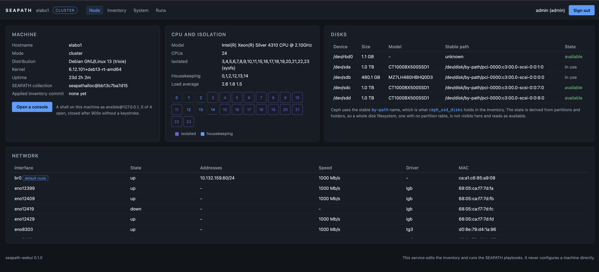
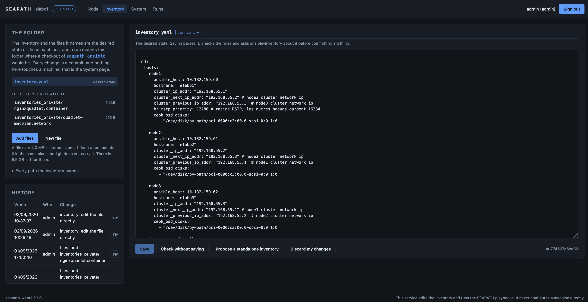
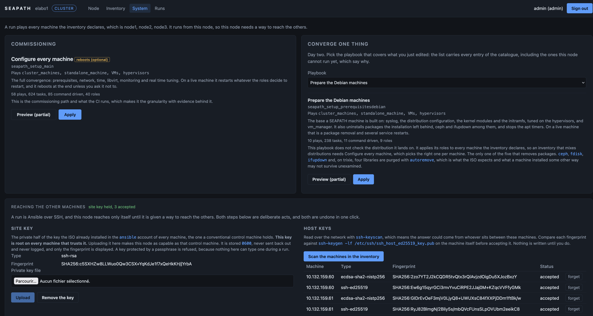
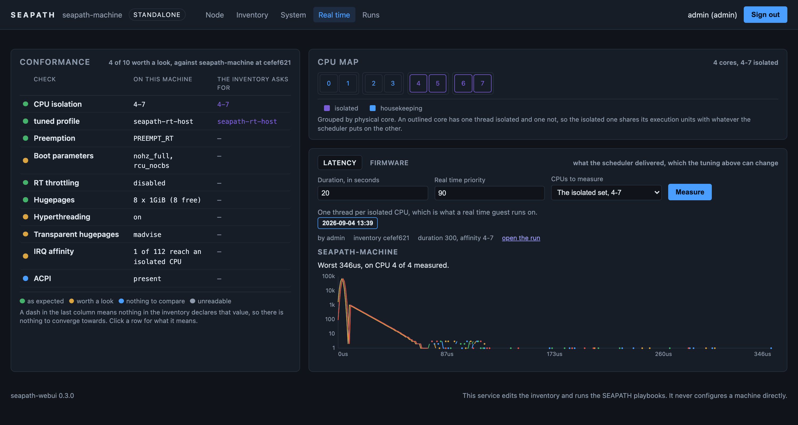
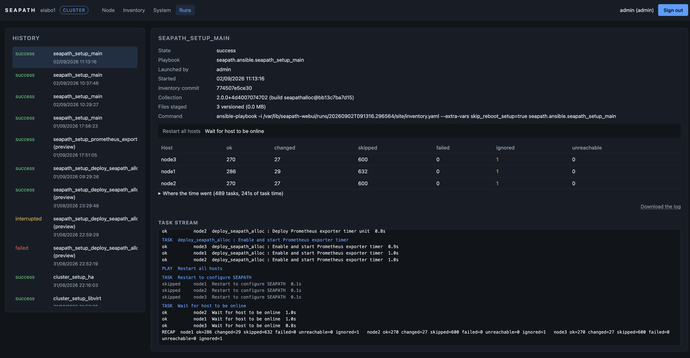

<!--
Copyright (C) 2026, RTE (http://www.rte-france.com)
SPDX-License-Identifier: CC-BY-4.0
-->

# seapath-webui

A management UI and REST API running on every SEAPATH node, so that a machine
installed from the ISO is usable from a browser, several machines can be joined
into a cluster, and Ceph can be deployed on top, with no separate Ansible
control machine.

**It does not configure machines. It edits the inventory and runs the SEAPATH
playbooks.** SEAPATH is a function converting an inventory into a running
infrastructure, and this service is a friendly front end onto that function, not
a way around it. The fourth machine disappears as a machine, not as a function:
its two jobs, holding the desired state and running the playbooks, move into the
cluster itself.

Concretely, the service does four things:

1. holds the inventory in a git repository replicated across the nodes, and
   edits it as the folder of files it is, seeded by hardware discovery. The
   repository holds the whole folder, meaning the quadlets, rules and templates
   the inventory names, mounted at run time where a control machine would put
   them;
2. brokers SSH trust between nodes, bootstrapped by a manual secret exchange in
   the Proxmox style, so any node can drive the others;
3. runs the upstream playbooks with `ansible-runner` and turns their event
   stream into a readable progress view;
4. exposes the runtime plane, meaning starting, stopping and migrating VMs,
   which is not configuration and does not belong in an inventory.

No SEAPATH role is rewritten, and no configuration file is rendered twice. What
the UI runs is what the CI tests.

## The pages



**Node** describes what the machine is. The hostname and the distribution, the
isolated and housekeeping CPUs as the kernel command line and `sysfs` report
them, the disks under the stable `by-path` name Ceph wants, and the interfaces.
It is read only, and the console button opens a shell on the `ansible` account
for the times a page is not enough.



**Inventory** is the desired state, edited as the folder of files it is. The
left column lists what the repository carries, meaning the inventory and every
quadlet, rule and template it names, with the history of who changed what. The
editor parses, checks the rules and asks `ansible-inventory` about the result
before committing anything.



**System** is where a machine actually changes. Commissioning runs the full
convergence; the picker beside it runs a single playbook when a single thing
was edited, and every entry says what it plays, what it will restart, and why
this node may not be allowed to run it. The lower half is the SSH trust: the
site key this node holds, and the host keys it has accepted, both undone in one
click.



**Real time** answers whether a machine came out of a convergence with the
tuning it was told to have. `isolcpus` and the tuned profile it selects are
declared in the inventory, so those two are compared against it, and the
commonest finding is a machine converged and never rebooted, which the kernel's
boot-time reading of `isolcpus` hides from every other view. The rest, SMT,
transparent hugepages, interrupt affinity, is reported with what it costs and
never as a failure: a site is entitled to its own answer there. Below the
checks, two measurements, both running on the machines through Ansible rather
than inside this container: `cyclictest` for what the scheduler delivered, and
`hwlatdetect` for what the firmware took without telling the kernel. A machine
that passes every check above and still misses its deadline is either a
firmware problem or a configuration one, and the second measurement is the only
thing that separates them. See D24 and D25 in
[docs/decisions.md](docs/decisions.md).



**Runs** is what happened. Every run keeps the playbook, who launched it, the
inventory commit it ran against and the exact `ansible-playbook` command, so a
run can be read months later or replayed from a control machine. The event
stream becomes the per host recap Ansible prints at the end, the task stream as
it arrives, and where the time went. The log is downloadable whole.

## Status

**M1**, pending validation on real hardware. A machine installed from the ISO
provisions its own SSH trust, describes itself into a git inventory, and is
configured from a browser with no Ansible control machine anywhere: the
inventory folder is edited file by file, and the upstream playbooks are run
with `ansible-runner` from the collection built into the image.

**M0** before it: skeleton, PAM authentication with sessions and CSRF, TLS
material generated at first boot, the read only node view and its API, the
image, the quadlet and the test harness. The node view describes what the
machine is, not what it is doing: live state stays with
`prometheus-node-exporter`, which every SEAPATH node runs.

M2, next, is the VM runtime plane through `vm_manager`.

## Development

```bash
python3.11 -m venv .venv
.venv/bin/pip install -r requirements-dev.txt
.venv/bin/pytest
```

The suite runs on a laptop with no cluster, no libvirt and no container, which
is a property worth keeping: everything that touches a host goes through an
adapter that has a fake. To browse the UI without a SEAPATH machine, set
`SEAPATH_WEBUI_USE_FAKES=1`, which serves invented readings and says so in the
log.

## Documents

1. [SPEC.md](SPEC.md) - principle, scope, architecture, milestones, risks.
2. [docs/inventory.md](docs/inventory.md) - the desired state: storage, writers,
   discovery, and the form to variable mapping. The heart of the product.
3. [docs/cluster-join.md](docs/cluster-join.md) - trust between nodes and
   cluster formation.
4. [docs/playbooks.md](docs/playbooks.md) - which playbooks the UI exposes, and
   what to warn about before each one.
5. [docs/api.md](docs/api.md) - REST API surface.
6. [docs/ceph.md](docs/ceph.md) - the Ceph flow, which is mostly a disk
   selector and a playbook.
7. [docs/deployment.md](docs/deployment.md) - image, quadlet, Ansible role, ISO.
8. [docs/decisions.md](docs/decisions.md) - settled decisions with their
   reasoning, and the open ones with a recommendation.
9. [docs/validation.md](docs/validation.md) - what has to be checked on a real
   machine, per milestone, because the test suite deliberately cannot.
10. [AGENTS.md](AGENTS.md) - conventions and definition of done.

## Related components

| Component | Repository | Relation |
|---|---|---|
| `seapath-ansible` | `~/dev/seapath-ansible` | The collection this service ships and runs. Roles are used unchanged. |
| `vm_manager` | `~/dev/vm_manager` | Python library for the runtime plane. Consumed, not reimplemented. |
| `vmmgrapi` role | `seapath-ansible/roles/vmmgrapi` | The existing thin API over `vm_manager`. Deprecation planned at M5: the ISO stops enabling it, the role stays. |
| `rtperfui` | `~/dev/rtperfui` | Packaging precedent: FastAPI, Jinja, quadlet with host mounts. |
| `insatomcat-exporter` | `~/dev/insatomcat-exporter` | Precedent for the image build and publish flow. |
