<!--
Copyright (C) 2026, RTE (http://www.rte-france.com)
SPDX-License-Identifier: CC-BY-4.0
-->

# seapath-webui

A management UI and REST API running on every SEAPATH node, so that a machine
installed from the ISO is usable from a browser, several machines can be joined
into a cluster, and Ceph can be deployed on top, with no separate Ansible
control machine.

**The configuration of a machine is edited here as an inventory and applied by
the SEAPATH playbooks.** SEAPATH is a function converting an inventory into a
running infrastructure, and this service is a friendly front end onto that
function, not a way around it. What it writes itself is that inventory, its own
trust material, and the Pacemaker metadata a guest carries on its disk image,
which [D31](docs/decisions.md#d31) records and bounds.

The fourth machine disappears as a machine, not as a function: its two jobs,
holding the desired state and running the playbooks, move into the cluster
itself.

Concretely, the service does five things:

1. holds the inventory in a git repository, one copy per node sent to the
   others by an explicit push, and edits it as the folder of files it is,
   seeded by hardware discovery. The repository holds the whole folder, meaning
   the quadlets, rules and templates the inventory names, mounted at run time
   where a control machine would put them;
2. brokers SSH trust between nodes, bootstrapped by a manual secret exchange in
   the Proxmox style, so any node can drive the others;
3. runs the upstream playbooks with `ansible-runner` and turns their event
   stream into a readable progress view;
4. exposes the runtime plane, meaning starting and stopping the guests and
   the containers, which is not configuration and does not belong in an
   inventory;
5. runs the acts made once rather than kept as state, a backup, a restore, a
   new partition, as runs of the upstream scripts and roles, recorded with the
   values they were given.

No SEAPATH role is rewritten, and no configuration file is rendered twice. What
the UI runs is what the CI tests.

## The pages

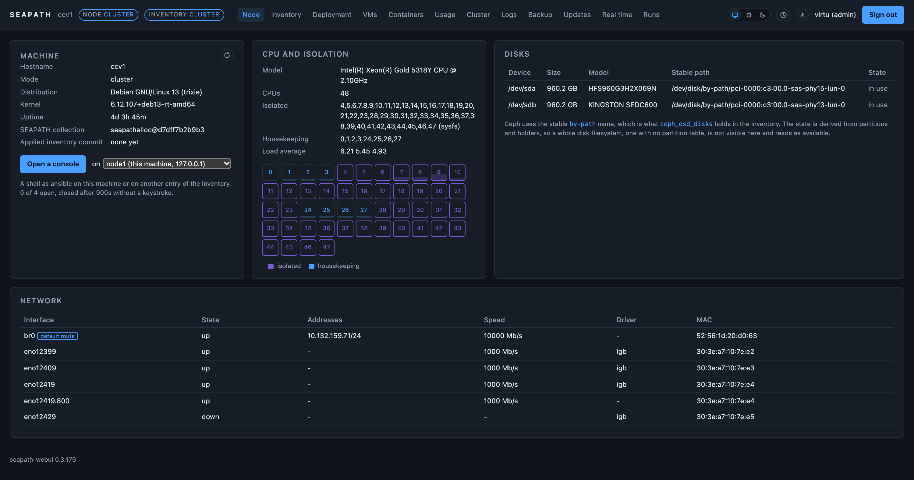

**Node** describes what the machine is. The hostname and the distribution, the
isolated and housekeeping CPUs as the kernel command line and `sysfs` report
them, the disks under the stable `by-path` name Ceph wants, and the interfaces.
It is read only, and the console button opens a shell on the `ansible` account
for the times a page is not enough, on this machine or on any other machine or
guest of the inventory a run reaches over SSH. That account may run `/bin/sh`
as root with no password, the rule Ansible's escalation uses, so `sudo sh` in a
console is root on the machine, and opening one asks for an administrator.
Other `sudo` commands ask for a password, `sudo -s` included when the login
shell is bash.

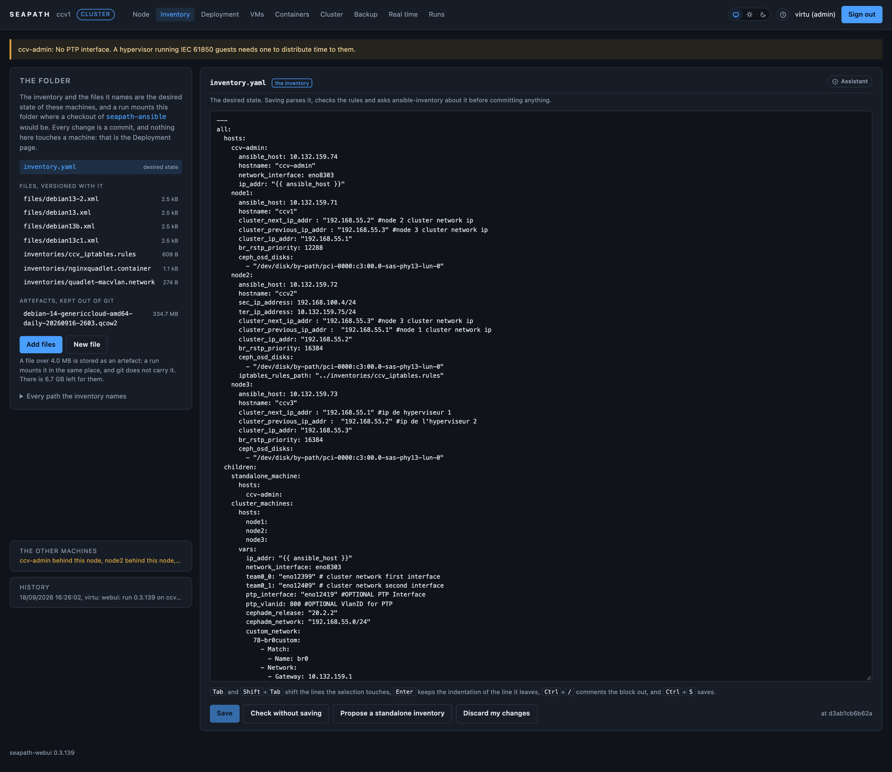

**Inventory** is the desired state, edited as the folder of files it is. The
left column lists what the repository carries, meaning the inventory and every
quadlet, rule and template it names, with the history of who changed what. The
editor parses, checks the rules and asks `ansible-inventory` about the result
before committing anything.

The box is a text area, and a file whose indentation carries meaning needs more
of one than a browser gives: `Tab` and `Shift`+`Tab` shift the lines the
selection touches, `Enter` carries the indentation of the line it leaves, one
level in under a key that opens a block and the dash repeated in a list, and
`Ctrl`+`/` comments the block out.

Beside them is a switch. An inventory is YAML with no schema, so `cephadm_netwrok`
is a name the file accepts, `ansible-inventory` parses and every rule passes,
and the answer arrives three minutes into a convergence from a role that read a
variable nobody set. With the assistant on, a name being typed is completed from
what may be written at that point in the file, each candidate carrying the role
that reads it and what goes wrong when it is wrong, so a guest entry is offered
`vm_disk` and a hypervisor is not. What is already written is read back the
other way: a name nothing reads, with the one that was probably meant, and a
variable written where nothing will read it. Nothing reads it means none of the
three readers an inventory has, the collection this node runs, Ansible itself,
and the file, which reads its own variables through every `{{ }}` in it. None
of this refuses a commit, because a variable of a site's own is a legitimate
name this service has never read and is written exactly the way a misspelling
is.

Under it sits the copy each of the other machines holds. Every node clones the
repository, and bringing the clones together is an act: the panel asks each
machine the inventory declares which commit it is on, and one button pushes
this node's branch to all of them over the connection a run already makes. Git
accepts a fast forward, so a machine carrying commits this node has never seen
is named and left alone, and forcing the push says in the panel what that
discards. See [D32](docs/decisions.md#d32).

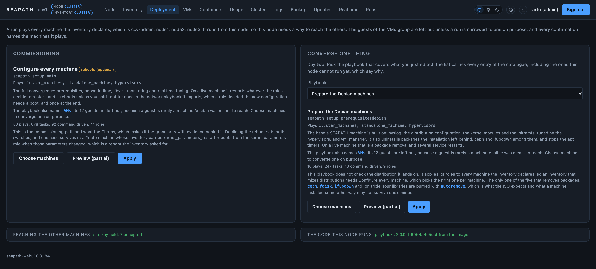

**Deployment** is where a machine actually changes. Commissioning runs the full
convergence; the picker beside it runs a single playbook when a single thing
was edited, and every entry says what it plays, what it will restart, and why
this node may not be allowed to run it. Under them sit two panels, shut until
they are needed. Reaching the other machines is the SSH trust: the site key
this node holds, and the host keys it has accepted, both undone in one click.
The code this node runs is the pair that decides what an apply executes: the
`seapath.ansible` collection, which arrives as a file when the fix is upstream
and the image is not out yet, and this service itself, which is
`seapath_webui_image` in the inventory and changes the way every other change
to a machine does, by an apply.

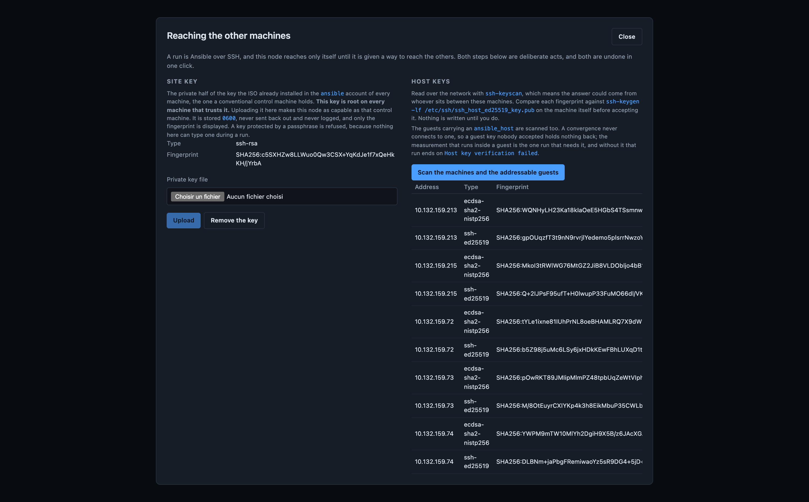

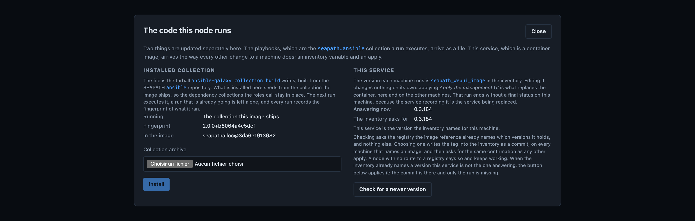

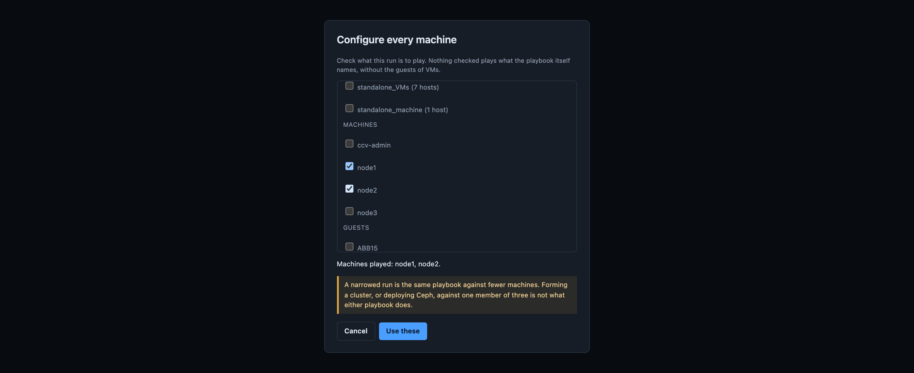

A run plays what its playbook names, less the guests of the `VMs` group: a
site's guests are appliances and vendor images as often as SEAPATH VMs, and the
first one refusing a connection would end the convergence of the machines the
operator came for. **Choose machines**, beside Apply, narrows a run before it
is launched. The window lists the groups, the machines and the guests of the
inventory as checkboxes, because `--limit` takes a union and converging two
hypervisors should be one launch, and the line under them names the machines
the current boxes resolve to. Nothing checked is the playbook's own scope. A
machine this node cannot reach is marked there, and narrowing to machines that
answer is how a node whose neighbour is down still converges itself. See D39 in
[docs/decisions.md](docs/decisions.md).

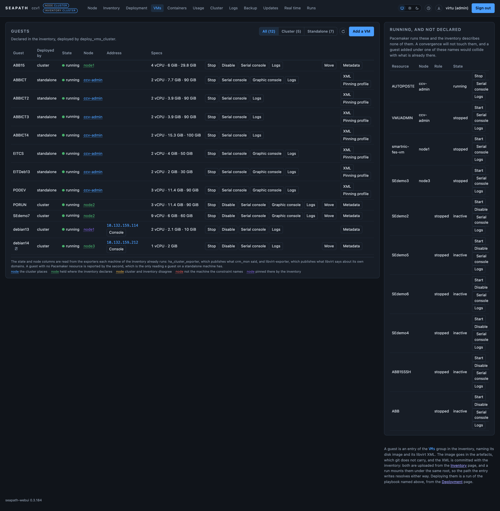

**VMs** is the guests, and it exists because a guest is one object whose parts
sit on three other pages. Its definition is an entry of the `VMs` group in the
inventory, the disk image and the libvirt XML it names are in the two stores
around that file, and what it is doing right now is one line of the Pacemaker
resource table. The page puts them on one row: the guest, which of the two
deployments creates it, whether it is running and where, and what can be done
to it. A Creation column joins them while a guest still carries its recipe or
`force`: whether a deployment would find the two files the entry names, and
the warning that matters most on the page, since the roles destroy and
recreate a guest that carries `force`. A converged inventory carries neither,
and the column stays away. The node it runs on says in its
colour what holds it there: blue where nothing does and the cluster placed it,
green where a constraint holds it exactly where its inventory entry declares,
amber where the cluster and the inventory disagree, with the whole sentence on
hover. The address a run reaches it at
sits beside them, with whether the entry carries a cloud-init seed and a
**Console** button for a shell inside the guest at that address. **Serial
console** is for the guest that no longer answers there: it runs
`vm-mgr console` as root on a hypervisor, and `vm_manager` finds the machine
running the guest and attaches to its serial port. A switch above the table
shows all the guests, the cluster ones or the standalone ones, with a count on
each. Beside the table sit the guests Pacemaker runs and the inventory
describes nowhere, with the same buttons: a convergence leaves them alone, and
a guest added under one of their names would collide with it.

Where an inventory describes a cluster and a standalone machine at once, each
guest says which of the two creates it, through `cluster_VMs` and
`standalone_VMs` as children of `VMs`. Everything follows from that one fact:
the playbook that deploys it, the module that starts and stops it, the options
its entry may carry, and whether it has an RBD image to hold metadata. A file
with one flat group says nothing and its guests take the file's own mode, which
is every inventory written before those groups existed.

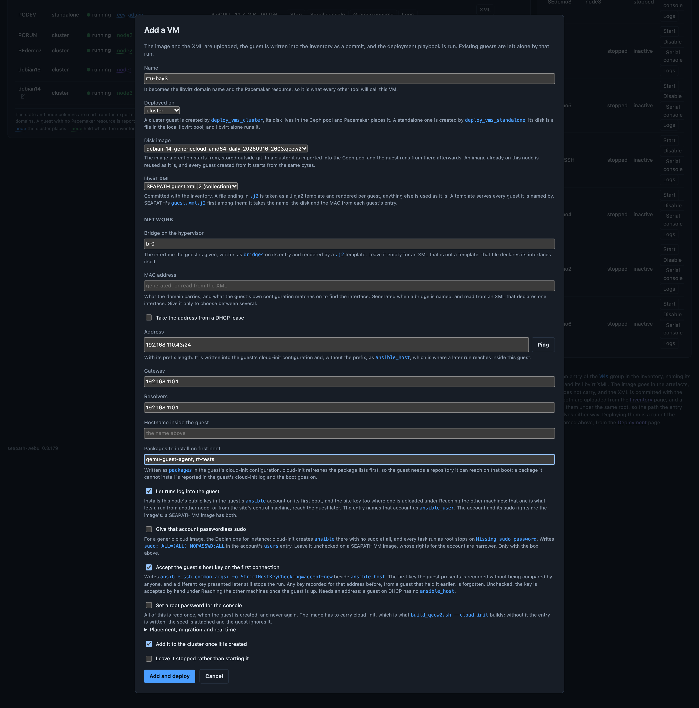

Adding a VM is the act it performs whole. Name the guest, give it a disk image
and a libvirt XML, and the page commits the entry and launches the deployment.
Each of the two files is either uploaded for this guest or picked from what
this node already holds, since one qcow2 built with cloud-init and SEAPATH's
`guest.xml.j2` serve every guest of a site once what makes each guest different
lives in its entry.

That difference is the network section. It writes three variables with three
readers: `bridges`, the interface the template renders; `cloud_init`, the
mapping the upstream `cloud_init_seed` role builds the guest's NoCloud seed
from, with its address, gateway, resolvers, hostname and the packages it
installs on its first boot; and `ansible_host`, where a later run reaches
inside the guest. The address is typed once and written twice. The MAC the seed
matches the interface by is generated in the QEMU range when none is given. A
network that could not work is refused before it is written: an address with no
prefix, a gateway outside the guest's network, an address or a MAC another host
of the file already holds. Two boxes, checked by default, make the guest
reachable by the runs that follow: this node's public key, and the site key
where one is held, go into the seed for the `ansible` account, and the entry
accepts the guest's host key on the first connection. The seed is built by the
role inside this container, like on any control machine, which is why the
image carries `cloud-localds`. See D48 in [docs/decisions.md](docs/decisions.md).

Three more things sit under the network. **Ping** beside the address sends
three echo requests from this node, because the file can refuse an address one
of its own hosts holds and has no view of the rest of the network. A box gives
the account the seed creates passwordless sudo, for a generic cloud image
whose `ansible` account otherwise stops every task a run becomes root for. And
a root password for the serial console, for the guest whose network did not
come up: it travels with the run that creates the guest, is spliced into that
run's copy of the inventory and wiped when the run ends, so no form of it is
ever committed. See D52.

Folded under all of that is what
`cluster_vm create` is given: placement, priority, live migration and its
timeouts, colocation, disk bus, the pinning profile. They are asked there
because each is written once into the guest's image metadata, and changing one
afterwards costs an outage. Live migration is on unless it is unchecked: without
it, every move Pacemaker makes for the guest, a failover or the standby before a
reboot, is a stop on one machine and a boot on the other. Underneath, those
are the writes this service has always made and the upstream playbook it has
always run: the image to the store git does not carry, the XML committed with
the inventory, the guest a splice into the file checked like every other
write, and a whole playbook of the collection. The operator is spared the trip through two pages
and a group name they have no reason to know.

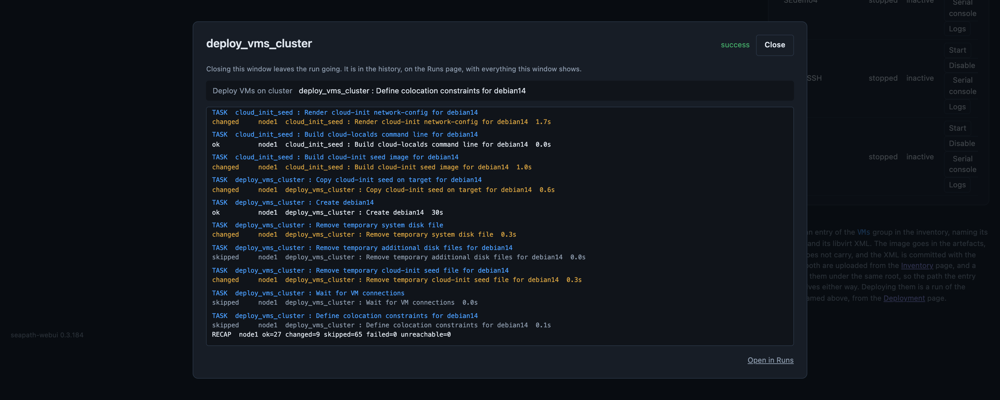

The run that follows opens in a window over the page, here the VMs page the
guest was added from, with the playbook, its state, the task being played and
the same task stream the Runs page draws, so the operator reads the result of
their own action on the page they launched it from.
Closing the window stops this browser watching and nothing else: the run
belongs to the service, keeps going and lands in the history. A run that ends
under an open window has the panels of the page read again, since what the
operator stayed for is what the run changed in the table underneath. Every
action of this UI that is a playbook opens the same window. See D43 in
[docs/decisions.md](docs/decisions.md).

Editing a guest's metadata is there too. A guest's Pacemaker configuration
lives as metadata on its RBD image, `vm_manager` writes those keys at creation
and never again, and the only upstream way to change one is to recreate the
guest from its seed image and lose its disk. So the page asks Ceph directly,
with `rbd image-meta`, the way the cluster view asks the exporters: a window
lists what the image carries, another edits one value, wide enough for the
libvirt domain that lives in there under `xml`, and removing a key is asked
before it happens because nothing here puts back what it took away. Every write
reads the image before and after and says what moved. Applying a change stops the guest and
rebuilds its Pacemaker resource, so it is a second button that names the outage
and appears only when something did move.

Starting and stopping a guest are there too, one button per row, offered as
whichever of the two would change something. Each is a run: one task calling
the upstream module, over the SSH path a convergence uses, under the same lock
so a start cannot slip in under a convergence. The confirmation names the guest
and says what stopping it does, because on these machines what a guest serves
is a substation function.

A cluster guest can also be taken out of the cluster and put back. **Disable**
is `cluster_vm disable`, run the same way: the guest is stopped and its
Pacemaker resource removed, while its RBD image, its metadata and its inventory
entry stay, and the row then says it is out of the cluster and that a
deployment leaves it alone. **Enable** builds the resource back from the image.
A disabled guest can be deleted for good, by an administrator: the entry is
committed out of the inventory first, so no deployment creates the guest again,
then `cluster_vm remove` deletes its RBD group, images and metadata. The disk
image and the XML stay, since another guest may be made from them.

Once a guest exists, the lines that created it are read by nobody: the roles
read `vm_disk`, `vm_template`, `cloud_init` and their neighbours only for a
guest the hypervisor does not have yet. So the deployment run that creates a
guest takes them out of its entry when it ends, as one commit authored by the
operator who launched the run and naming it, and leaves the variables later
runs read. Each guest is judged on what the machines report, so a guest the run
did not manage to create keeps its recipe for the next one. The Creation column
names the files while the entry still carries them. Afterwards a struck out
sheet of paper beside the guest's name offers to delete them: the image and the
XML the guest was made from, deleted from this node when no other entry names
them. See D49 and D50 in [docs/decisions.md](docs/decisions.md).

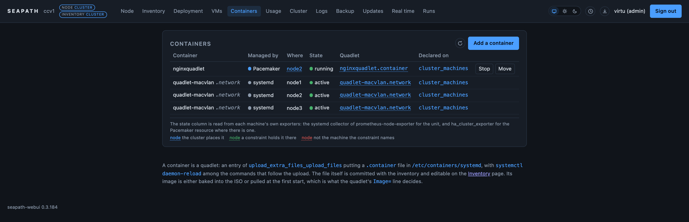

**Containers** is the same idea one layer down, and almost all of it already
existed. A container in SEAPATH is a quadlet: `upload_extra_files` copies a
`.container` file to `/etc/containers/systemd`, podman's generator turns it
into a systemd unit at the next `daemon-reload`, and on a cluster
`extra_crm_cmd_to_run` hands that unit to Pacemaker's systemd resource agent.
Three variables the upstream roles already read, which the page reads back and
joins to what the machines publish: the unit state comes from the systemd
collector of the `node_exporter` every node runs, out of the same exposition
the CPU pool is read from, so the reading costs no new request anywhere.

Who owns a container decides what the row offers. Pacemaker holds a resource
for it: one row, one act, and the cluster chooses the node. Nothing holds one:
a row per machine, because the same quadlet is a unit on each machine the
inventory sends it to and stopping it on one says nothing about the others.
Declaring one writes the same entries a site would have written by hand, at the
scope the operator picks, and the entry lands where those machines already read
the list from, because Ansible replaces a variable rather than merging it and
an entry in the wrong place silently stops the site's other uploads. What makes
it real is a run, named rather than launched: the playbook that uploads a
quadlet is the prerequisites one, which reconfigures a great deal more than a
container.

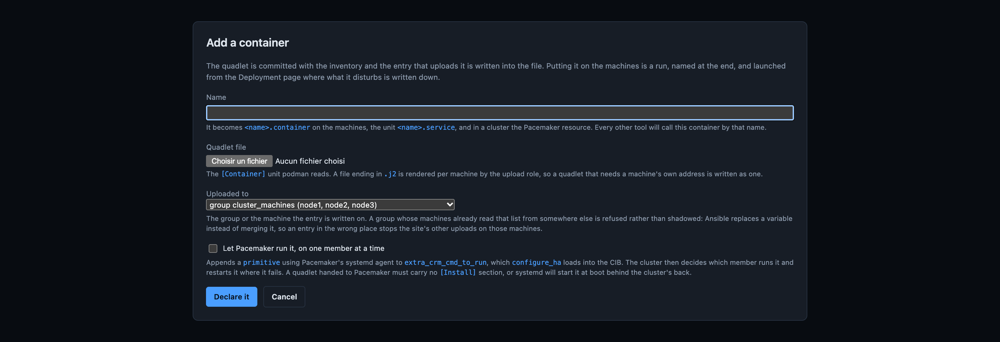

The Quadlet column names the file podman reads, and clicking it shows that
file, since its dozen lines answer most of what the row raises: which image,
which ports, and whether an `[Install]` section is about to start the container
behind Pacemaker's back. It is read from the inventory folder and from nowhere
else on this machine, and editing it stays on the Inventory page, where a write
is a commit. A container the cluster holds says where it runs in the colour of
its node name, like a guest, and carries **Move** and **Return**, the two acts
the Cluster page offers on the same Pacemaker resource. Their confirmation says
what a move costs a container: podman has no live migration, so the unit stops
on one member and starts on the other.

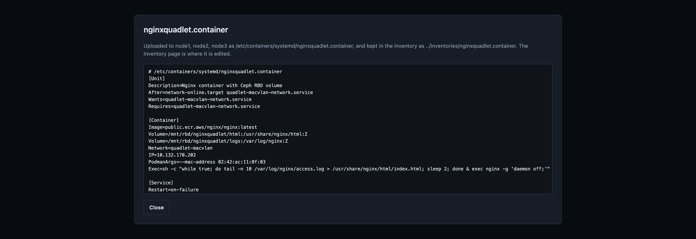

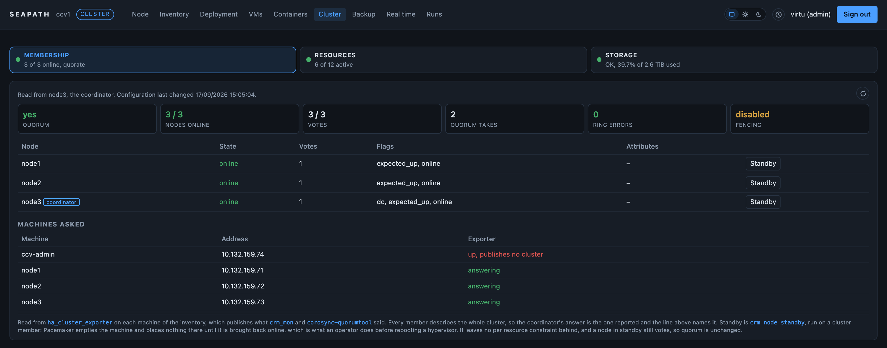

**Cluster** is what the machines are doing right now, which is the one question
the other pages cannot answer: which node that VM is on, whether the cluster
has quorum, whether an OSD went down last night. Membership leads with quorum,
because a cluster without it moves nothing. Resources is the table with the
failure in it, and in SEAPATH those are mostly VMs, one Pacemaker resource per
guest. Storage is Ceph: health with the checks Ceph itself is raising,
capacity, monitors, OSDs with their host and device, pools and placement
groups. All of it is read from the `ha_cluster_exporter` and the Ceph manager
that a deployed cluster already runs, one HTTP GET per machine, and every
member is asked because which of them answers is itself part of the answer.

The page monitors nothing and holds no state of its own, deliberately. Each
panel carries a small **Read again**, which asks the reading that panel is
drawn from and swaps it in one pass, so a table is brought up to date without
the reload that refetched the whole page and sent every panel back through its
spinner. The VMs, Containers and CPU pool panels carry the same control, and a
switch in the top bar takes that same reading every ten seconds until it is
turned off. It holds while the tab is hidden, while the panel is in a view
that is not open, and while a dialog is waiting on an answer about a machine,
so a browser left open overnight asks the substation nothing. Coming back to a
page, each panel is drawn at once from what this browser last read, with the
age of that reading in the line the spinner used to hold, and its buttons stay
held until the fresh reading lands, because the row an operator aims at may
have moved in the meantime. What this page
offers besides is placement, at both scopes. **Refresh** on a resource clears
the operation history Pacemaker keeps for it, so a failure that has been dealt
with stops holding it down, and a second button does the same for every
resource on every node. **Move** asks Pacemaker to run a resource on a named
node, and **Return** gives the placement back: a move writes the `cli-prefer`
constraint that `preferred_host` already produces, because `vm_manager`
honours that field by running the same `crm resource move`, and the return
puts the declared placement back so a clear cannot drop it silently.
**Standby** empties a machine and its inverse fills it again, which is what an
operator does before rebooting a hypervisor and the honest way to watch a
cluster place its own guests. Each of them runs as an ordinary one task run on
a cluster member rather than as a command inside this container, and none of
them writes a file on a host or touches the inventory. Evicting an OSD is not
offered, for the reason `docs/ceph.md` gives, and adding a machine or a disk
stays an inventory change and a run.

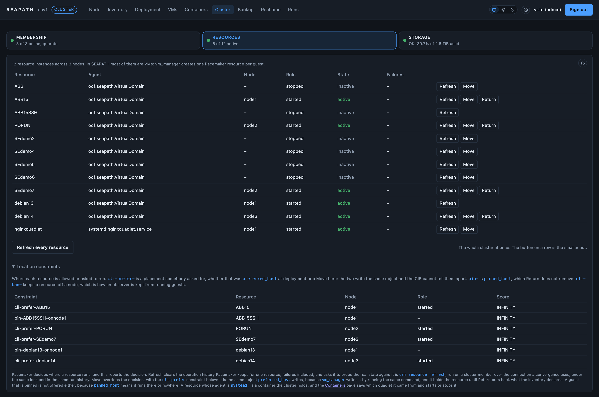

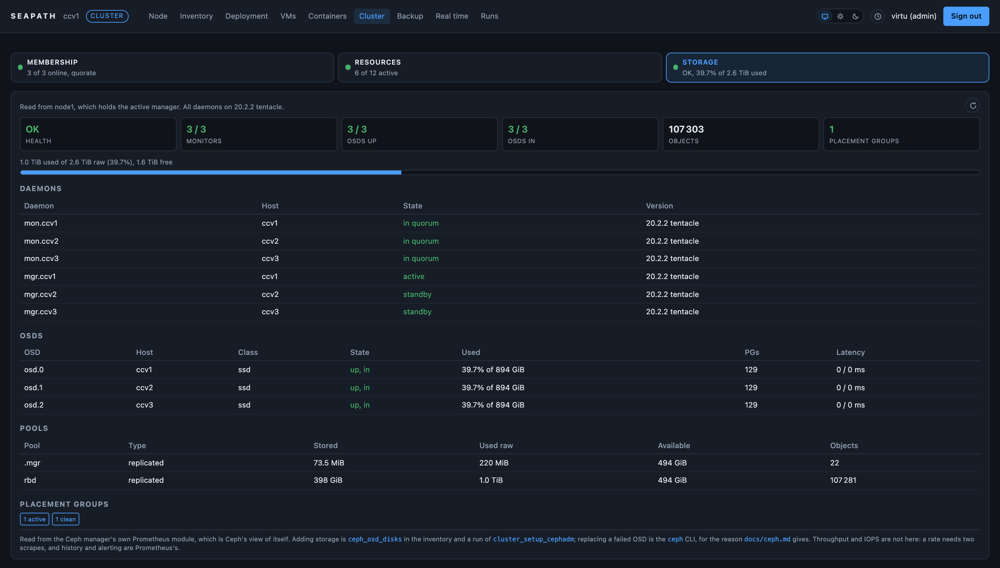

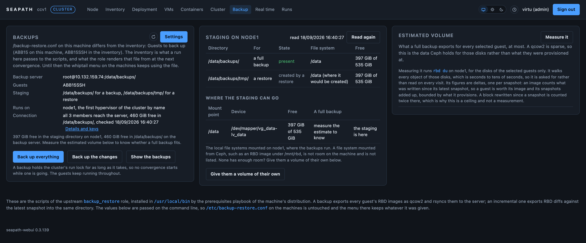

**Backup** is the `backup_restore` role of the collection, which upstream is
four scripts and a whiptail menu on every machine. The scripts are kept, and the
menu stays on the machines: this page holds the seven values the menu holds, as
inventory variables, and passes them on the command line of a run. **Back up
everything** exports the RBD images of every selected guest as qcow2 and rsyncs
them to the backup server. **Back up the changes** exports the RBD diffs since
the latest snapshot into the same directory. Each is a run on one named member,
under the cluster's run lock, and its confirmation names what it erases, since
a full backup purges the snapshots each image carries. The guests keep running
throughout. Where the `/etc/backup-restore.conf` of a machine, which its menu
still reads, says something else than the inventory, the page names the
difference, and the next convergence renders the file from the inventory. See
D53 and D55 in [docs/decisions.md](docs/decisions.md).

Around the buttons sit the readings that decide whether pressing one will
work, all asked of the member the backups run on. The staging directories,
where a full backup writes every qcow2 before it sends anything, with the file
system each one is on and its room: on a machine installed from the ISO the
root file system is a few tens of gigabytes, and that is where a first backup
fails, an hour in. The local file systems the staging could move to, one click
each, which commits the two directories under that mount point and runs the
role that creates them. The estimated volume, `rbd du` of the selected guests'
disks, behind a button because it walks every object of them. And, once both
are known, whether a full backup fits, on the staging and on the server. Where
no file system has the room, a local volume can be created, a partition in the
free space after the last one of a disk, by a run of the upstream
`configure_local_storage` role on that machine alone. The run records the
volume and the inventory keeps nothing, since a partition is made once. See D56
and D58.

The backups are pushed by root on a member, with no password, so each member
needs a key the backup server accepts and the server's host key. The page asks
every member to connect the way a backup connects, and where one cannot, it
does both halves: the role generates a key dedicated to the backups and records
the server's host key once an operator has confirmed it, and the page appends
the members' keys to the server's `authorized_keys` with the account's password
typed once, neither stored nor logged. That append is the one write this
service makes on a machine outside the inventory. See D57.

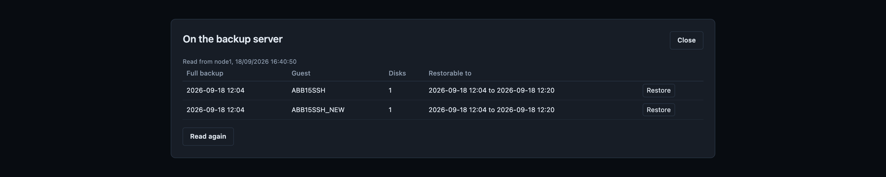

**Show the backups** asks the server what it holds, over one SSH connection
through the member, and opens the listing in a window that says when it was
read. It is a read, so it takes no lock and leaves no run behind. A restore
starts from a row: the window turns into its confirmation, naming the guest
about to be replaced and the date its changes are replayed up to, and the
restore is a run of `restore_vm.sh`, which recreates the guest with
`vm-mgr create --force`. See D54.

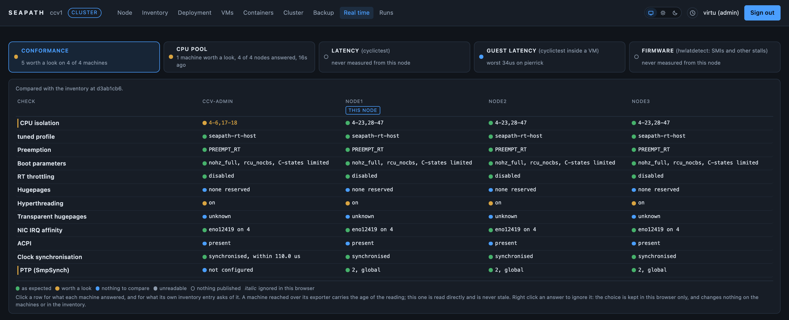

**Real time** answers whether the machines came out of a convergence with the
tuning they were told to have. One row per check, one column per machine: each
node publishes its own tuning through the exporter it already runs, so twelve
checks answer for the whole cluster from the page an operator has open, and no
SSH command is issued to draw them. Opening a row says what each machine
answered and what its own inventory entry asks of it. The commonest finding is
a machine converged and never rebooted, which the kernel's boot-time reading of
`isolcpus` hides from every other view, and which used to be visible only on
the machine the browser happened to be pointed at. Two measurements back it,
both running on the machines through Ansible rather than inside this container:
`cyclictest` for what the scheduler delivered, and `hwlatdetect` for what the
firmware took without telling the kernel. A machine that passes every check and
still misses its deadline is either a firmware problem or a configuration one,
and the second measurement is the only thing that separates them.

Two of the rows are about time, because every sampled value carries the clock
of the machine that produced it. Clock synchronisation reads the flag chrony
maintains under timemaster, with its estimated error, from the timex collector
of `node_exporter`. PTP reads the IEC 61850-9-2 SmpSynch level `ptpstatus`
publishes, 2 for a grandmaster traceable to a global reference, with the
grandmaster, its clock class and the offset. See D40 in
[docs/decisions.md](docs/decisions.md).

A site sometimes accepts a finding on purpose, hyperthreading left on after it
was measured being the usual one, and a tab that stays amber for it hides the
next finding worth a look. A right click on an answer ignores it on that
machine, and on a check's name for any machine or all of them. The answer is
still drawn, faded, and left out of the tab's count and colour, which says how
many were ignored. The choice is kept by this browser and written nowhere else.

The CPU pool has a view of its own, holding **every machine the inventory
declares**, read from the same request as the tuning: which core carries which
guest, interrupt, container or shared slot. `seapath-alloc` computes that on
each host and publishes it, and this container could not compute it if it
wanted to, since occupancy is the affinity of every QEMU thread in `/proc`.
Asking the exporter is the opposite of holding a second source of truth for it.

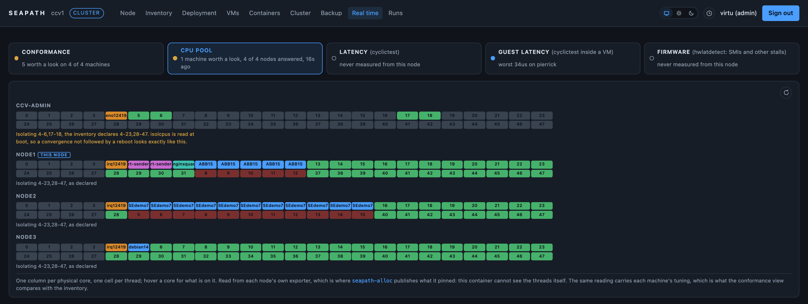

It is the one page laid out as an application rather than as a document. Five
views, Conformance, CPU pool, Latency, Guest latency and Firmware, and a bar of
tabs that carries what each of them found: its worst status as a dot, and the one line
its panel would lead with. The glance costs no click, and the view behind the
tab has the whole screen, which is what twelve checks across four machines of
forty-eight threads need. Every reading is fetched before the first tab is
drawn, so switching asks the machines for nothing. See D24, D26, D27 and D28 in
[docs/decisions.md](docs/decisions.md).

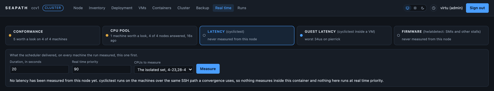

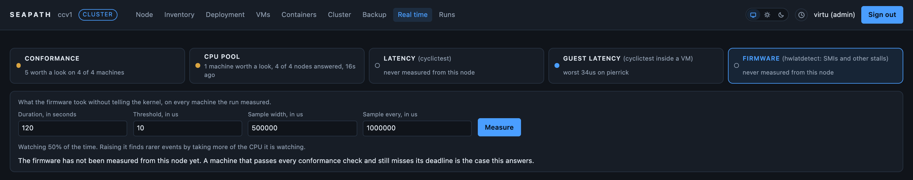

Latency and Firmware carry a form, which the other two views have no use for.
Reading what a machine publishes costs one HTTP GET; a measurement asks the
machines to spend real time doing it, so it is launched, confirmed and filed
like any other run. `cyclictest` takes a duration, a real time priority and the
CPUs to measure, with the isolated set offered by name because that is the set
a real time guest runs on. `hwlatdetect` takes a duration, a threshold and the
two numbers that decide how much of the wall clock the hardware is watched for,
shown as a percentage while they are typed. The confirmation names the values
the form holds and the machines that will be played, the run lands in the
history beside the convergences, and each view keeps the earlier ones, so a
figure is read beside the inventory commit the machines were carrying when it
was taken.

A fifth view measures inside a guest. The figure above is the hypervisor's
scheduler; the application in the guest waits for that plus the scheduling of
its vCPU threads, the VM exits and the virtualised timer, and the difference
between the two, taken under the same inventory commit, is what virtualisation
costs on that machine. The guest measured is the operator's own, in place: the
panel offers the guests whose inventory entry carries an address, one is chosen,
and the run is narrowed to it, because loading every guest at real time priority
at once measures the contention between the measurements. What a guest needs to
be measurable is said on the panel, with this node's public key beside it to
copy: an address, that key in the account Ansible connects as with sudo, and
`rt-tests` installed. This service writes none of the three inside a VM, since
that would be configuring a machine behind Ansible's back. A guest added from
the VMs page gets all three through its entry: the address, the key and the
packages are written into its cloud-init seed, which the upstream role builds
and the guest applies on its first boot. See D41 and D48 in
[docs/decisions.md](docs/decisions.md).

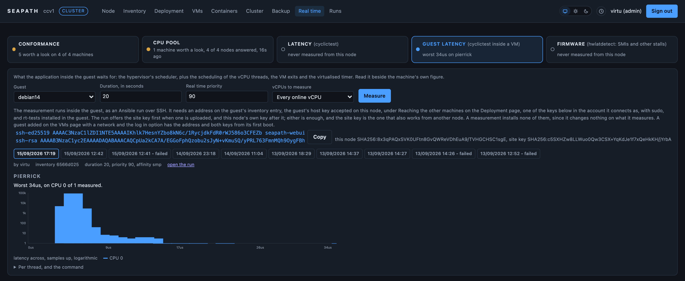

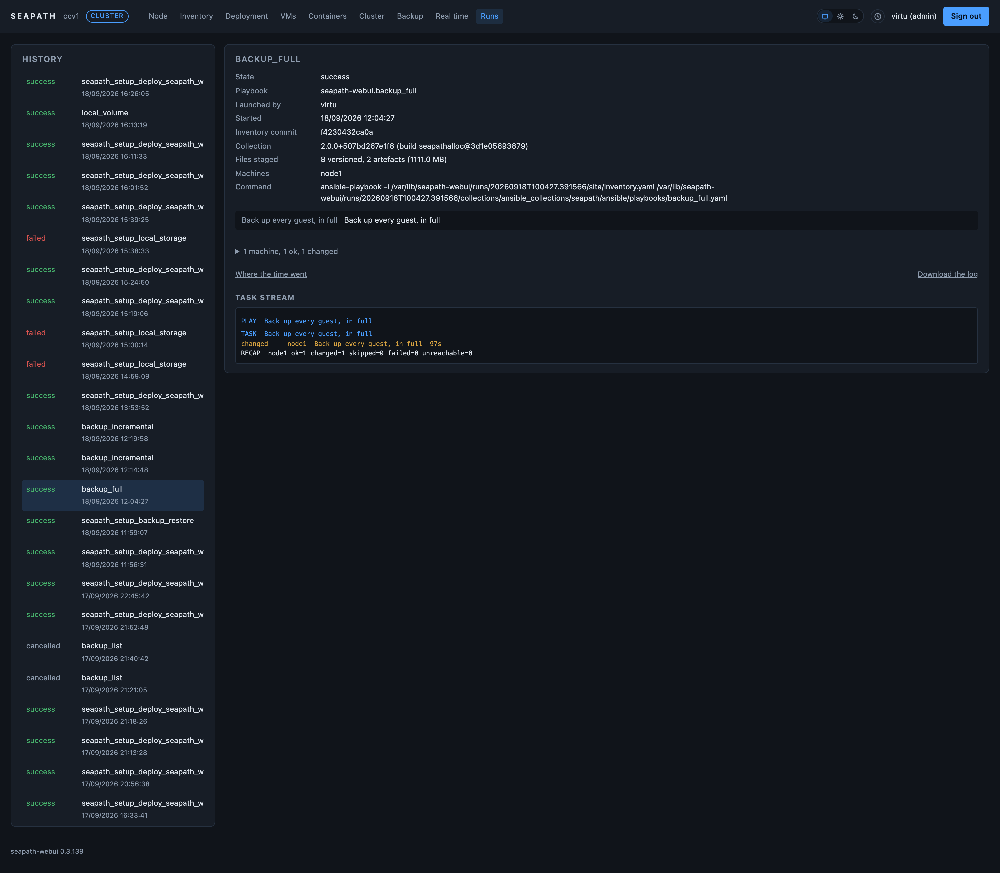

**Runs** is what happened. Every run keeps the playbook, who launched it, the
inventory commit it ran against and the exact `ansible-playbook` command, so a
run can be read months later or replayed from a control machine. The event
stream becomes the per host recap Ansible prints at the end, the task stream as
it arrives, and where the time went. The log is downloadable whole.

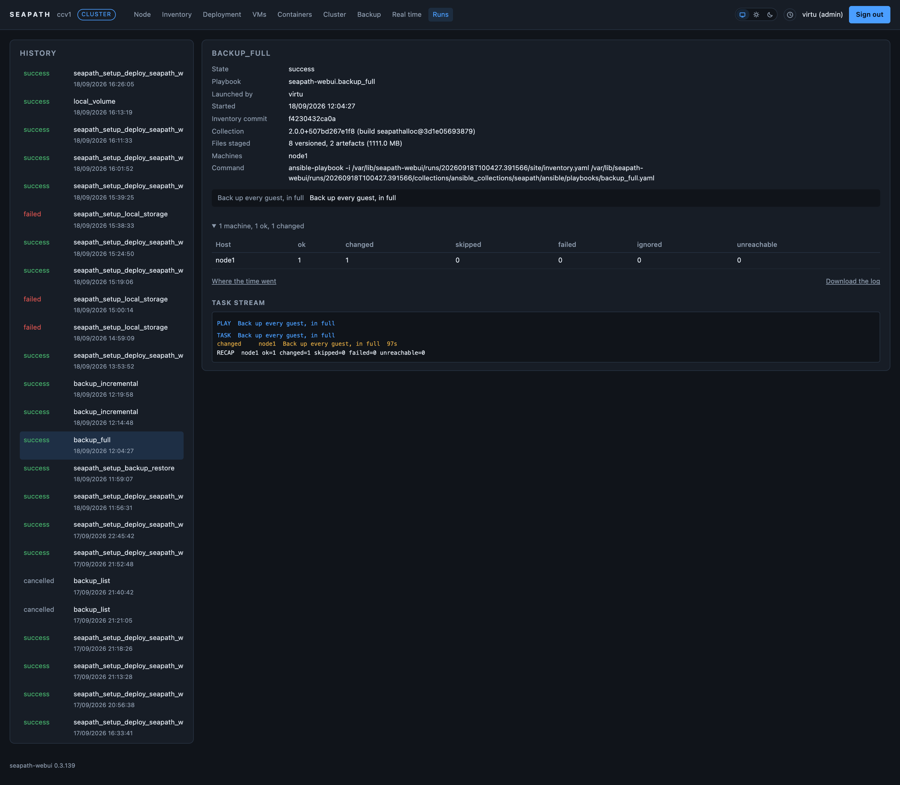

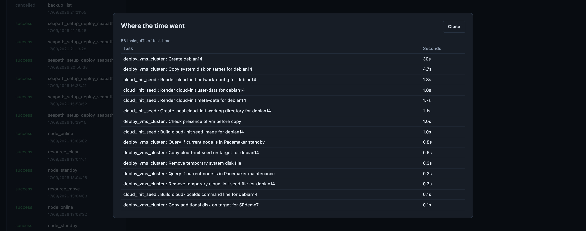

Every page is drawn in the palette the operator's system asks for, and the
switch in the top bar overrides it in either direction or hands the choice
back. Beside it sits the switch for the automatic reading, and both are kept
by the browser rather than by this service: neither of them reaches a machine.
The console keeps its dark ground in both, because what it draws is what a
shell and an Ansible run wrote for a terminal.

## Status

**M1**, pending validation on real hardware. A machine installed from the ISO
provisions its own SSH trust, describes itself into a git inventory, and is
configured from a browser with no Ansible control machine anywhere: the
inventory folder is edited file by file, and the upstream playbooks are run
with `ansible-runner` from the collection built into the image.

**M0** before it: skeleton, PAM authentication with sessions and CSRF, TLS
material generated at first boot, the read only node view and its API, the
image, the quadlet and the test harness. The node view describes what the
machine is, not what it is doing: live state stays with
`prometheus-node-exporter`, which every SEAPATH node runs.

Two things arrived after M1 and are validated separately. The **Real time**
page, which reads the tuning every node publishes through its exporter and runs
the two measurements as ordinary playbooks. And the update path of D23: the
collection a node runs can be replaced by a file, and the version of this
service each machine runs is an inventory variable that an apply carries.
[docs/validation.md](docs/validation.md) holds one checklist per milestone and
per piece that arrived on its own, from M0 to the backups. Almost all of it is
still to be run on a real machine.

M2 is the VMs and the containers, and most of it is in. For a guest, the `VMs`
group is read as guests rather than as machines, the page joins what the
inventory declares to what Pacemaker reports, adding one is one act that gives
it its network through a cloud-init seed, starting and stopping one are runs,
the RBD metadata is read and edited from the same page, a guest can be sent to
a named node and given back to the cluster, disabled, enabled and deleted, and
its creation lines leave its entry once it is created, with the files they
named deleted from the row. The snapshots are what is left, and follow the
same shape. For a container,
the quadlets the inventory uploads are read back with the unit each machine
made of them, declaring one writes the three variables the upstream roles
already read, starting or stopping one is a run, and one the cluster holds is
moved and returned like a guest.

The **Backup** page arrived beside them. It runs the four scripts of the
upstream `backup_restore` role as runs, says before a backup whether it will
fit, sets up the members' connection to the backup server, gives the staging a
volume of its own when the machine has none with the room, and restores one
guest from the listing.

Two pieces of M3 arrived early, because the pages being written needed them.
The **Cluster** page reads Pacemaker and Ceph from the exporters a deployed
cluster already runs, and clears the operation history of one resource or of
every resource in one act. And the inventory copies are brought together by the
push above, which [D32](docs/decisions.md#d32) chose in place of the elected
lead D3 had left open.

## Development

```bash
python3.11 -m venv .venv
.venv/bin/pip install -r requirements-dev.txt
.venv/bin/pytest
```

The suite runs on a laptop with no cluster, no libvirt and no container, which
is a property worth keeping: everything that touches a host goes through an
adapter that has a fake. To browse the UI without a SEAPATH machine, set
`SEAPATH_WEBUI_USE_FAKES=1`, which serves invented readings and says so in the
log.

Each shipped change is its own version, and [CHANGELOG.md](CHANGELOG.md) lists
them. [CONTRIBUTING.md](CONTRIBUTING.md) says what a change has to carry, and
[SECURITY.md](SECURITY.md) how to report a vulnerability.

## Documents

1. [SPEC.md](SPEC.md) - principle, scope, architecture, milestones, risks.
2. [docs/inventory.md](docs/inventory.md) - the desired state: storage, writers,
   discovery, and the form to variable mapping. The heart of the product.
3. [docs/cluster-join.md](docs/cluster-join.md) - trust between nodes and
   cluster formation.
4. [docs/playbooks.md](docs/playbooks.md) - which playbooks the UI exposes, and
   what to warn about before each one.
5. [docs/api.md](docs/api.md) - REST API surface.
6. [docs/ceph.md](docs/ceph.md) - the Ceph flow, which is mostly a disk
   selector and a playbook.
7. [docs/deployment.md](docs/deployment.md) - image, quadlet, Ansible role, ISO.
8. [docs/decisions.md](docs/decisions.md) - settled decisions with their
   reasoning, and the open ones with a recommendation.
9. [docs/validation.md](docs/validation.md) - what has to be checked on a real
   machine, per milestone, because the test suite deliberately cannot.
10. [AGENTS.md](AGENTS.md) - conventions and definition of done.

## Related components

| Component | Relation |
|---|---|
| `seapath-ansible` | The collection this service ships and runs. Roles are used unchanged. |
| `vm_manager` | Python library for the runtime plane. Consumed, not reimplemented. |
| `vmmgrapi` role | The existing thin API over `vm_manager`, in `roles/vmmgrapi` of the collection. Deprecation planned at M5: the ISO stops enabling it, the role stays. |
| `rtperfui` | Packaging precedent: FastAPI, Jinja, quadlet with host mounts. |
| `insatomcat-exporter` | Precedent for the image build and publish flow. |

## License

The code is Apache-2.0, and the text is in [LICENSE](LICENSE). The documents,
meaning this README, [SPEC.md](SPEC.md) and everything under `docs/`, are
CC-BY-4.0. Every file carries an SPDX header naming which of the two applies to
it.
