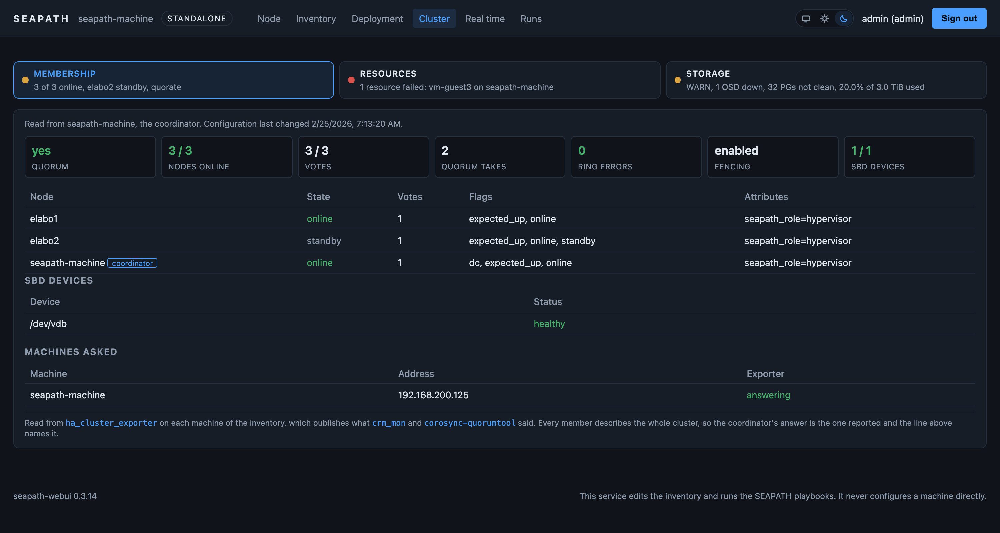

<!--
Copyright (C) 2026, RTE (http://www.rte-france.com)
SPDX-License-Identifier: CC-BY-4.0
-->

# seapath-webui

A management UI and REST API running on every SEAPATH node, so that a machine
installed from the ISO is usable from a browser, several machines can be joined
into a cluster, and Ceph can be deployed on top, with no separate Ansible
control machine.

**It does not configure machines. It edits the inventory and runs the SEAPATH
playbooks.** SEAPATH is a function converting an inventory into a running
infrastructure, and this service is a friendly front end onto that function, not
a way around it. The fourth machine disappears as a machine, not as a function:
its two jobs, holding the desired state and running the playbooks, move into the
cluster itself.

Concretely, the service does four things:

1. holds the inventory in a git repository replicated across the nodes, and
   edits it as the folder of files it is, seeded by hardware discovery. The
   repository holds the whole folder, meaning the quadlets, rules and templates
   the inventory names, mounted at run time where a control machine would put
   them;
2. brokers SSH trust between nodes, bootstrapped by a manual secret exchange in
   the Proxmox style, so any node can drive the others;
3. runs the upstream playbooks with `ansible-runner` and turns their event
   stream into a readable progress view;
4. exposes the runtime plane, meaning starting, stopping and migrating VMs,
   which is not configuration and does not belong in an inventory.

No SEAPATH role is rewritten, and no configuration file is rendered twice. What
the UI runs is what the CI tests.

## The pages


**Node** describes what the machine is. The hostname and the distribution, the
isolated and housekeeping CPUs as the kernel command line and `sysfs` report
them, the disks under the stable `by-path` name Ceph wants, and the interfaces.
It is read only, and the console button opens a shell on the `ansible` account
for the times a page is not enough. That account has passwordless sudo, so a
console is root on the machine, and opening one asks for an administrator.


**Inventory** is the desired state, edited as the folder of files it is. The
left column lists what the repository carries, meaning the inventory and every
quadlet, rule and template it names, with the history of who changed what. The
editor parses, checks the rules and asks `ansible-inventory` about the result
before committing anything.


**Deployment** is where a machine actually changes. Commissioning runs the full
convergence; the picker beside it runs a single playbook when a single thing
was edited, and every entry says what it plays, what it will restart, and why
this node may not be allowed to run it. Under them sit two panels, shut until
they are needed. Reaching the other machines is the SSH trust: the site key
this node holds, and the host keys it has accepted, both undone in one click.
The code this node runs is the pair that decides what an apply executes: the
`seapath.ansible` collection, which arrives as a file when the fix is upstream
and the image is not out yet, and this service itself, which is
`seapath_webui_image` in the inventory and changes the way every other change
to a machine does, by an apply.

**VMs** is the guests, and it exists because a guest is one object whose parts
sit on three other pages. Its definition is an entry of the `VMs` group in the
inventory, the disk image and the libvirt XML it names are in the two stores
around that file, and what it is doing right now is one line of the Pacemaker
resource table. The page puts them on one row: the guest, whether it is running
and where, whether a deployment would find the two files it names, and what the
next run does to it, `force` being the word that matters there since the roles
destroy and recreate a guest that carries it. It is read only. A guest is
changed by a commit on the Inventory page and deployed by a run from the
Deployment page.



**Cluster** is what the machines are doing right now, which is the one question
the other pages cannot answer: which node that VM is on, whether the cluster
has quorum, whether an OSD went down last night. Membership leads with quorum,
because a cluster without it moves nothing. Resources is the table with the
failure in it, and in SEAPATH those are mostly VMs, one Pacemaker resource per
guest. Storage is Ceph: health with the checks Ceph itself is raising,
capacity, monitors, OSDs with their host and device, pools and placement
groups. All of it is read from the `ha_cluster_exporter` and the Ceph manager
that a deployed cluster already runs, one HTTP GET per machine, and every
member is asked because which of them answers is itself part of the answer.

The page monitors and administers nothing, deliberately. Putting a node in
standby, clearing a failure count or evicting an OSD is a `crm` or a `ceph`
command, and this service runs neither: adding a machine or a disk is an
inventory change and a run, and the rest belongs to Pacemaker, to Ceph, or to
the shell one click away on the Node page.


**Real time** answers whether the machines came out of a convergence with the
tuning they were told to have. One row per check, one column per machine: each
node publishes its own tuning through the exporter it already runs, so ten
checks answer for the whole cluster from the page an operator has open, and no
SSH command is issued to draw them. Opening a row says what each machine
answered and what its own inventory entry asks of it. The commonest finding is
a machine converged and never rebooted, which the kernel's boot-time reading of
`isolcpus` hides from every other view, and which used to be visible only on
the machine the browser happened to be pointed at. Two measurements back it,
both running on the machines through Ansible rather than inside this container:
`cyclictest` for what the scheduler delivered, and `hwlatdetect` for what the
firmware took without telling the kernel. A machine that passes every check and
still misses its deadline is either a firmware problem or a configuration one,
and the second measurement is the only thing that separates them.

The CPU pool has a view of its own, holding **every machine the inventory
declares**, read from the same request as the tuning: which core carries which
guest, interrupt, container or shared slot. `seapath-alloc` computes that on
each host and publishes it, and this container could not compute it if it
wanted to, since occupancy is the affinity of every QEMU thread in `/proc`.
Asking the exporter is the opposite of holding a second source of truth for it.

It is the one page laid out as an application rather than as a document. Four
views, Conformance, CPU pool, Latency and Firmware, and a bar of tabs that
carries what each of them found: its worst status as a dot, and the one line
its panel would lead with. The glance costs no click, and the view behind the
tab has the whole screen, which is what ten checks across four machines of
forty-eight threads need. Every reading is fetched before the first tab is
drawn, so switching asks the machines for nothing. See D24, D26, D27 and D28 in
[docs/decisions.md](docs/decisions.md).


**Runs** is what happened. Every run keeps the playbook, who launched it, the
inventory commit it ran against and the exact `ansible-playbook` command, so a
run can be read months later or replayed from a control machine. The event
stream becomes the per host recap Ansible prints at the end, the task stream as
it arrives, and where the time went. The log is downloadable whole.

Every page is drawn in the palette the operator's system asks for, and the
switch in the top bar overrides it in either direction or hands the choice
back. The console keeps its dark ground in both, because what it draws is what
a shell and an Ansible run wrote for a terminal.

## Status

**M1**, pending validation on real hardware. A machine installed from the ISO
provisions its own SSH trust, describes itself into a git inventory, and is
configured from a browser with no Ansible control machine anywhere: the
inventory folder is edited file by file, and the upstream playbooks are run
with `ansible-runner` from the collection built into the image.

**M0** before it: skeleton, PAM authentication with sessions and CSRF, TLS
material generated at first boot, the read only node view and its API, the
image, the quadlet and the test harness. The node view describes what the
machine is, not what it is doing: live state stays with
`prometheus-node-exporter`, which every SEAPATH node runs.

Two things arrived after M1 and are validated separately. The **Real time**
page, which reads the tuning every node publishes through its exporter and runs
the two measurements as ordinary playbooks. And the update path of D23: the
collection a node runs can be replaced by a file, and the version of this
service each machine runs is an inventory variable that an apply carries.
[docs/validation.md](docs/validation.md) holds the checklists for M0, M1 and
the Real time page, and all three are still to be run on a real machine.

M2 is the VMs. Its declarative half is in: the `VMs` group is read as guests
rather than as machines, and the VMs page joins what the inventory declares to
what Pacemaker reports. Its imperative half, starting, stopping and migrating a
guest through `vm_manager`, is next.

## Development

```bash
python3.11 -m venv .venv
.venv/bin/pip install -r requirements-dev.txt
.venv/bin/pytest
```

The suite runs on a laptop with no cluster, no libvirt and no container, which
is a property worth keeping: everything that touches a host goes through an
adapter that has a fake. To browse the UI without a SEAPATH machine, set
`SEAPATH_WEBUI_USE_FAKES=1`, which serves invented readings and says so in the
log.

## Documents

1. [SPEC.md](SPEC.md) - principle, scope, architecture, milestones, risks.
2. [docs/inventory.md](docs/inventory.md) - the desired state: storage, writers,
   discovery, and the form to variable mapping. The heart of the product.
3. [docs/cluster-join.md](docs/cluster-join.md) - trust between nodes and
   cluster formation.
4. [docs/playbooks.md](docs/playbooks.md) - which playbooks the UI exposes, and
   what to warn about before each one.
5. [docs/api.md](docs/api.md) - REST API surface.
6. [docs/ceph.md](docs/ceph.md) - the Ceph flow, which is mostly a disk
   selector and a playbook.
7. [docs/deployment.md](docs/deployment.md) - image, quadlet, Ansible role, ISO.
8. [docs/decisions.md](docs/decisions.md) - settled decisions with their
   reasoning, and the open ones with a recommendation.
9. [docs/validation.md](docs/validation.md) - what has to be checked on a real
   machine, per milestone, because the test suite deliberately cannot.
10. [AGENTS.md](AGENTS.md) - conventions and definition of done.

## Related components

| Component | Repository | Relation |
|---|---|---|
| `seapath-ansible` | `~/dev/seapath-ansible` | The collection this service ships and runs. Roles are used unchanged. |
| `vm_manager` | `~/dev/vm_manager` | Python library for the runtime plane. Consumed, not reimplemented. |
| `vmmgrapi` role | `seapath-ansible/roles/vmmgrapi` | The existing thin API over `vm_manager`. Deprecation planned at M5: the ISO stops enabling it, the role stays. |
| `rtperfui` | `~/dev/rtperfui` | Packaging precedent: FastAPI, Jinja, quadlet with host mounts. |
| `insatomcat-exporter` | `~/dev/insatomcat-exporter` | Precedent for the image build and publish flow. |
